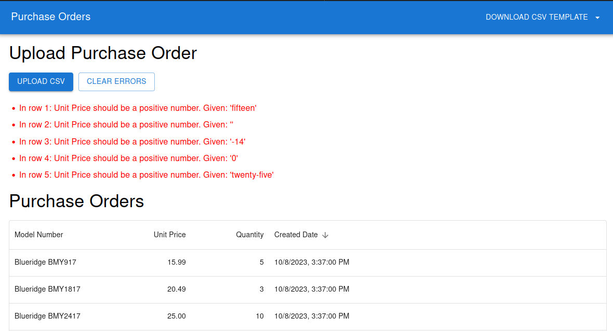
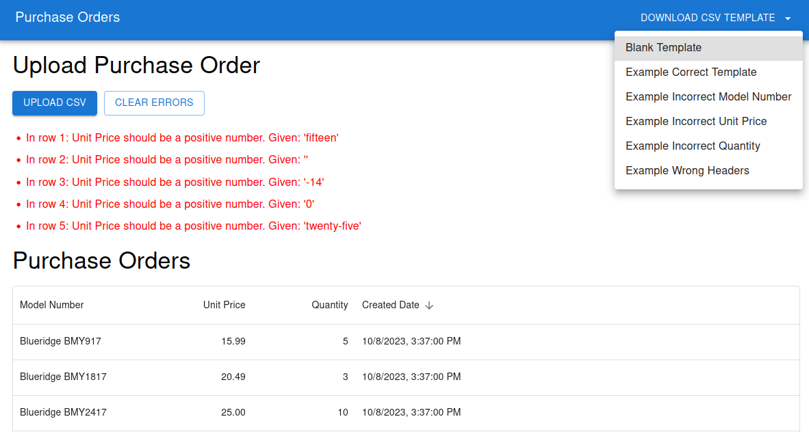

# CSV Bulk Upload

> Estimated time: 3.5 hours

## Plan:

- Have a React frontend application that will be served at / using MUI
- Frontend will have a csv uploader and products list table, csv template download
- Backend API will have two endpoints /api/v1/purchase-orders/bulk-insert and /api/v1/purchase-orders/list
- Database will be MySQL with a startup script that generates the `purchase_orders` table
- Docker compose will be utilized to launch the application at http://localhost:3000 
- Unit tests for React components, unit tests for backend functions

## Usage

- Run unit tests `yarn test`
- Run `docker-compose up --build` and navigate to http://localhost:3000
- Download the template from the navigation and fill OR download a correct/incorrect example from Navigation
- Upload the CSV and see the results in the table if they are valid, or see the error messages
- Refresh the page to see that the data persists

## Screenshots

